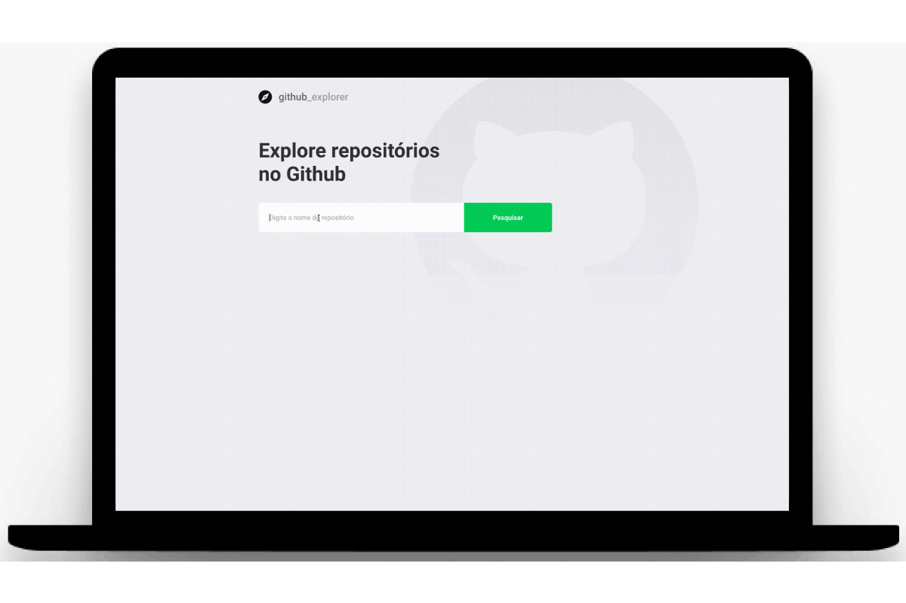

<h1 align="center">
  
</h1>

<h3 align="center">
  Exploring repositories on Github
</h3>

<p align="center">
  

  

  

  

  
</p>

<br>

### 📝 About the project
A simple project developed to search and list Github repositories made with React.JS/Hooks, using REST APIs for integration with Github APIs and local storage to store the found repositories. By clicking on the repositories you will be redirected to a new page that will be listed as Issues of that repository.

<div align="center">
  
</div>

<br>

## 🖥 Front-End
The Front-End was developed with React.JS and TypeScript. For standardization and organization of the code, ESLint, Prettier and EditorConfig were used. The styling was done with Styled-Components. The navigation screens were made with React Router DOM. To connect with de API of the Github was used axios. The repositories founded stay saved in the local storage of the browser.

### 🛠 Technologies
- **[React.JS](https://reactjs.org/)**
- *[TypeScript](https://www.typescriptlang.org/)*
- *[React Router DOM](https://reacttraining.com/react-router/web/guides/quick-start)*
- *[Axios](https://nodemon.io/)*

<br>

## 🏁 Starting the project
Clone the project: `git clone https://github.com/leopacciulli/Exploring-repositories.git`

<br>

🖥 To run the **Front-End**, in a terminal tab, execute the following commands:

````zsh
# to enter the project folder
$ cd explorando-repositorios

# to download the dependencies
$ yarn

# to start the application on port 3000
$ yarn start
````
<br>

---


<h3 align="center">
  Made with love by 💙 Leonardo Pacciulli
</h3>

<p align="center">
  <a href="https://www.linkedin.com/in/leonardo-pacciulli">
    
  </a>
  <a href="https://www.facebook.com/paculli">
    
  </a>
  <a href="https://www.instagram.com/leopacciulli/">
    
  </a>
</p>
